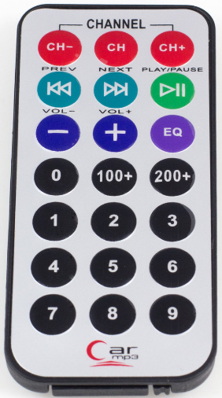
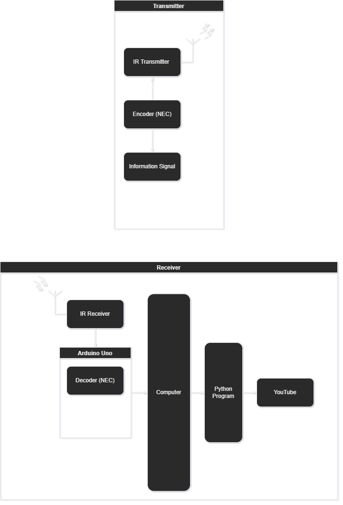
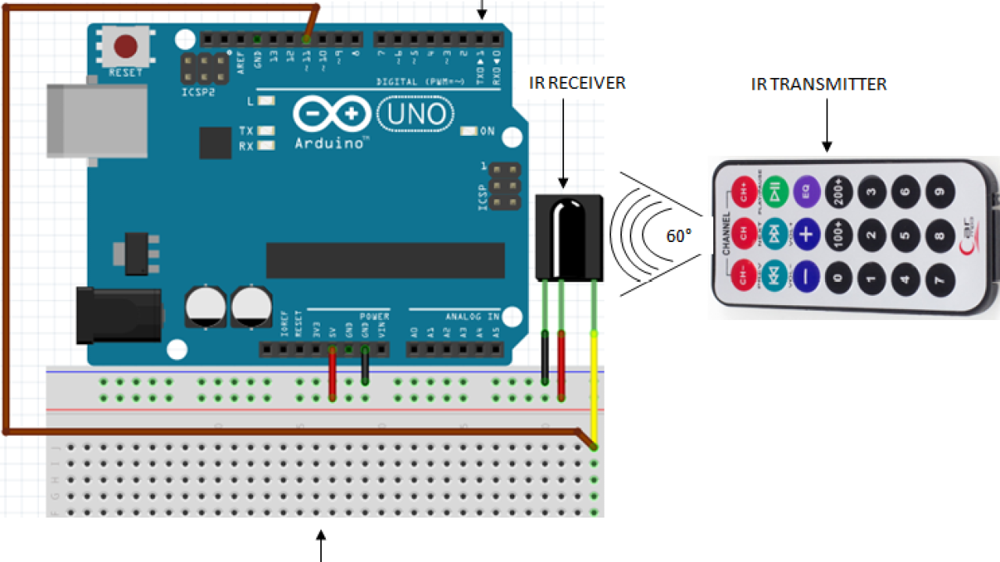

# IRRemote
## Usage 

> Run `driver.py` to start the controller

Press the following buttons to trigger the command:- 

| Button     | Command              |
| :--------: | :------------------: |
| PLAY/PAUSE | play/pause           |
| NEXT       | fast forward         |
| PREV       | rewind               |
| VOL+       | volume up            |
| VOL-       | volume down          |
| 0          | fullscreen           |
| CH         | cycle windows        |
| EQ         | toggle system volume |

## Block Diagram

## Circuit Diagram

