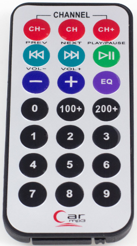

# IRRemote

## Usage 

> Run `driver.py` to start the controller

Press the following buttons to trigger the command:- 

|   Button   	|    Command   	|
|:----------:	|:------------:	|
| PLAY/PAUSE 	|  play/pause  	|
|    NEXT    	| fast forward 	|
|    PREV    	|    rewind    	|
|    VOL+    	|   volume up  	|
|    VOL-    	|  volume down 	|

